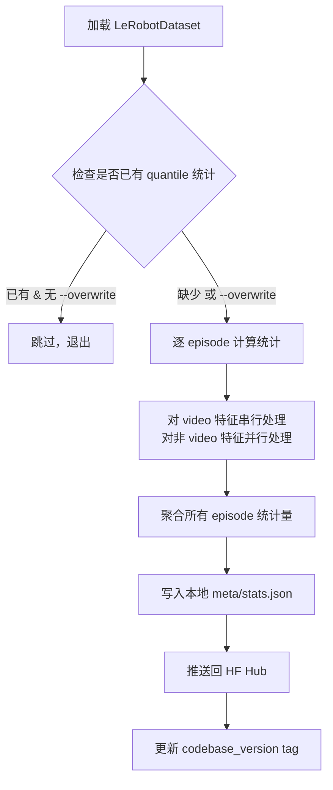

# augment_dataset_quantile_stats.py 脚本详解与 Quantile 统计量格式

本文档详细解释 `augment_dataset_quantile_stats.py` 脚本的工作流程，以及生成的 `meta/stats.json` 文件结构。
它其实就是在遍历你采集的整个数据集，统计每个维度的动作（比如有 6 个关节 + 1 个夹爪 = 7 个通道），分别找出这 7 个通道在物理世界中真正有效的 q01 和 q99 边界，然后生成一份配置文件保存下来。
---

## 脚本定位与作用

**源码位置**: `src/lerobot/scripts/augment_dataset_quantile_stats.py`

**作用**: 为 LeRobot v2.1 格式的数据集生成 Pi0.5 所需的 **Quantile 归一化统计量**。

**背景**: Pi0.5 默认使用 `QUANTILES` 归一化模式（而非传统 `MEAN_STD` ），需要每个特征（state/action）的 q01/q10/q50/q90/q99 百分位数。v2.1 数据集通常缺少这些统计量，此脚本用于补全。

---

## 脚本工作流程



### 详细步骤

1. **加载数据集**: 使用 `LeRobotDataset(repo_id, root)` 加载本地/云端数据集
2. **检查现有统计**: `has_quantile_stats()` 检测是否已有 q01/q99 等键
3. **逐 episode 计算**:
   - 遍历每个 episode 的每一帧数据
   - 对数值特征（state/action）计算 min/max/mean/std/count + 5 个 quantile
   - 对图像/视频特征计算 per-channel 统计（shape `(C,)` ）
4. **聚合**: `aggregate_stats()` 将所有 episode 的统计合并为全局统计
5. **写入本地**: `write_stats()` 序列化为 JSON 到 `meta/stats.json`
6. **推送云端**: `dataset.push_to_hub()` 更新 HF Hub 上的数据集

---

## Quantile 统计量格式

### 文件位置

```
{dataset_root}/
├── data/
│   └── chunk-000/
│       └── episode_000000.parquet
├── videos/
│   └── chunk-000/
│       └── observation.images.front/
│           └── episode_000000.mp4
└── meta/
    ├── info.json       # 数据集元数据（格式版本、特征定义等）
    └── stats.json      # ← 统计量文件（脚本生成/更新）
```

### stats.json 结构

```json
{
  "observation.state": {
    "min":   [0.01, -0.52, 1.10, -0.30, -0.05, 0.00],
    "max":   [0.15, -0.30, 1.50,  0.20,  0.05, 0.80],
    "mean":  [0.08, -0.41, 1.30, -0.05,  0.00, 0.40],
    "std":   [0.03,  0.05, 0.08,  0.08,  0.02, 0.15],
    "count": [47513],
    "q01":   [0.02, -0.50, 1.12, -0.25, -0.04, 0.02],
    "q10":   [0.04, -0.47, 1.20, -0.15, -0.02, 0.15],
    "q50":   [0.08, -0.41, 1.30, -0.05,  0.00, 0.40],
    "q90":   [0.12, -0.35, 1.40,  0.10,  0.02, 0.65],
    "q99":   [0.14, -0.32, 1.48,  0.18,  0.04, 0.78]
  },
  "action": {
    "min":   [...],
    "max":   [...],
    "mean":  [...],
    "std":   [...],
    "count": [47513],
    "q01":   [...],
    "q10":   [...],
    "q50":   [...],
    "q90":   [...],
    "q99":   [...]
  },
  "observation.images.front": {
    "min":   [[0.0], [0.0], [0.0]],
    "max":   [[1.0], [1.0], [1.0]],
    "mean":  [[0.45], [0.48], [0.42]],
    "std":   [[0.20], [0.18], [0.22]],
    "count": [47513],
    "q01":   [[0.02], [0.03], [0.01]],
    "q10":   [[0.10], [0.12], [0.08]],
    "q50":   [[0.42], [0.45], [0.38]],
    "q90":   [[0.85], [0.88], [0.82]],
    "q99":   [[0.98], [0.99], [0.97]]
  }
}
```

### 字段解释

| 字段 | 含义 | 计算方式 |
|------|------|----------|
| `min` / `max` | 全局最小/最大值 | 所有 episode 的最小值/最大值 |
| `mean` | 加权平均 | 按 frame 数量加权平均各 episode 的 mean |
| `std` | 全局标准差 | 聚合所有 episode 数据后计算 |
| `count` | 总样本数 | 整个数据集的 frame 总数 |
| `q01` | 1st percentile | 1% 分位数（低于此值的占 1%） |
| `q10` | 10th percentile | 10% 分位数 |
| `q50` | 50th percentile | 中位数 |
| `q90` | 90th percentile | 90% 分位数 |
| `q99` | 99th percentile | 99% 分位数 |

### 形状规则

| 特征类型 | shape | stats 各字段 shape | 说明 |
|----------|-------|-------------------|------|
| **向量** (state/action) | `(D,)` | `(D,)` | 每个维度独立统计 |
| **图像/视频** | `(H, W, C)` → 存储为 `(C,)` | `(C,)` | per-channel 统计，空间维度被 reduce |

---

## 关键源码定位

| 功能 | 文件 | 行号 |
|------|------|------|
| 默认 quantiles 列表 | `compute_stats.py` | 20 |
| 单特征统计计算 | `compute_stats.py` | 425-474 ( `get_feature_stats` ) |
| 多 episode 聚合 | `compute_stats.py` | 605-626 ( `aggregate_stats` ) |
| 写入 stats.json | `io_utils.py` | 167-175 ( `write_stats` ) |
| stats.json 路径 | `utils.py` | 77 ( `STATS_PATH = "meta/stats.json"` ) |
| 视频串行处理逻辑 | `augment_dataset_quantile_stats.py` | 147-153 |
| 非视频并行处理 | `augment_dataset_quantile_stats.py` | 154-174 |

---

## 特征对应关系

以 `youliangtan/so101-table-cleanup` 为例， `info.json` 中的特征定义：

```json
{
  "features": {
    "observation.state": {
      "dtype": "float32",
      "shape": [6],
      "names": [
        "shoulder_pan.pos",   // 肩水平旋转
        "shoulder_lift.pos",  // 肩垂直抬升
        "elbow_flex.pos",     // 肘弯曲
        "wrist_flex.pos",     // 腕弯曲
        "wrist_roll.pos",     // 腕旋转
        "gripper.pos"         // 夹爪开合
      ]
    },
    "action": {
      "dtype": "float32",
      "shape": [6],
      "names": ["shoulder_pan.pos", ...]  // 同上
    },
    "observation.images.front": {
      "dtype": "video",
      "shape": [480, 640, 3]
    },
    "observation.images.wrist": {
      "dtype": "video",
      "shape": [480, 640, 3]
    }
  }
}
```

### state vs action 区别

| 特征 | 含义 | 数据来源 |
|------|------|----------|
| `observation.state` | 关节当前实际位置 | 机械臂编码器反馈（实测） |
| `action` | 目标关节位置 | 遥操作手柄/键盘输入的指令（目标） |

在训练中，state 作为视觉-语言-动作 (VLA) 模型的输入观测，action 作为监督学习的标签。

---

## 使用示例

### 检查数据集是否已有 quantile 统计

```python
from lerobot.datasets.lerobot_dataset import LeRobotDataset

dataset = LeRobotDataset("youliangtan/so101-table-cleanup")
stats = dataset.meta.stats

# 检查 observation.state 是否有 q01
if stats and "observation.state" in stats:
    has_q = "q01" in stats["observation.state"]
    print(f"Has quantile stats: {has_q}")
```

### 手动读取 stats.json

```python
import json
from pathlib import Path

stats_path = Path("/path/to/dataset/meta/stats.json")
with open(stats_path) as f:
    stats = json.load(f)

# 查看 observation.state 的 q99
print(stats["observation.state"]["q99"])
# [0.14, -0.32, 1.48, 0.18, 0.04, 0.78]
```

---

## 参考

* [Pi0.5 + SO-ARM101 LoRA 微调完整 Pipeline](./pi05_so101_lora_pipeline.md)
* LeRobot 源码: `src/lerobot/datasets/compute_stats.py`
* LeRobot 源码: `src/lerobot/scripts/augment_dataset_quantile_stats.py`
